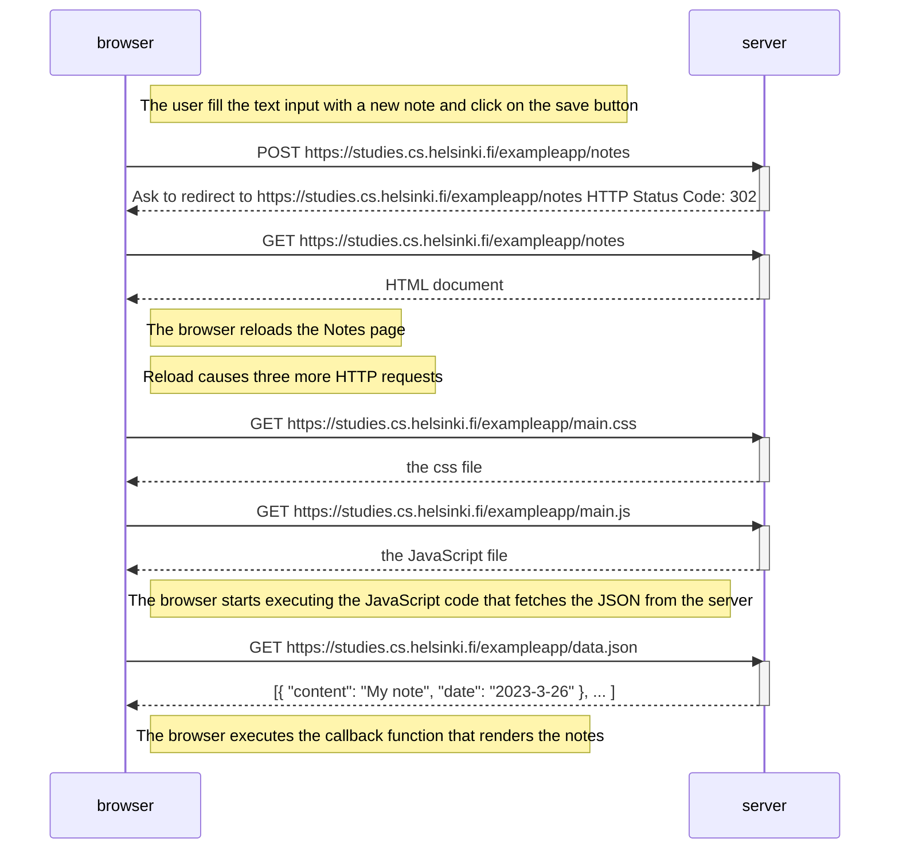

```mermaid
sequenceDiagram
    participant browser
    participant server

    Note right of browser: The user fill the text input with a new note and click on the save button
    browser->>server: POST https://studies.cs.helsinki.fi/exampleapp/notes
    activate server
    server-->>browser: Ask to redirect to https://studies.cs.helsinki.fi/exampleapp/notes HTTP Status Code: 302
    deactivate server

    browser->>server: GET https://studies.cs.helsinki.fi/exampleapp/notes
    activate server
    server-->>browser: HTML document
    deactivate server
    
    Note right of browser: The browser reloads the Notes page
    Note right of browser: Reload causes three more HTTP requests
    browser->>server: GET https://studies.cs.helsinki.fi/exampleapp/main.css
    activate server
    server-->>browser: the css file
    deactivate server

    browser->>server: GET https://studies.cs.helsinki.fi/exampleapp/main.js
    activate server
    server-->>browser: the JavaScript file
    deactivate server

    Note right of browser: The browser starts executing the JavaScript code that fetches the JSON from the server

    browser->>server: GET https://studies.cs.helsinki.fi/exampleapp/data.json
    activate server
    server-->>browser: [{ "content": "My note", "date": "2023-3-26" }, ... ]
    deactivate server

    Note right of browser: The browser executes the callback function that renders the notes
```
