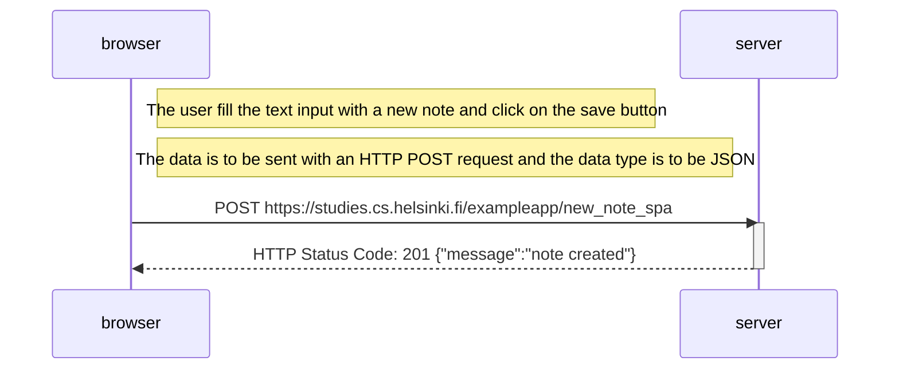

```mermaid
sequenceDiagram
    participant browser
    participant server

    Note right of browser: The user fill the text input with a new note and click on the save button
    Note right of browser: The data is to be sent with an HTTP POST request and the data type is to be JSON
    browser->>server: POST https://studies.cs.helsinki.fi/exampleapp/new_note_spa
    activate server
    server-->>browser: HTTP Status Code: 201 {"message":"note created"}
    deactivate server
```
